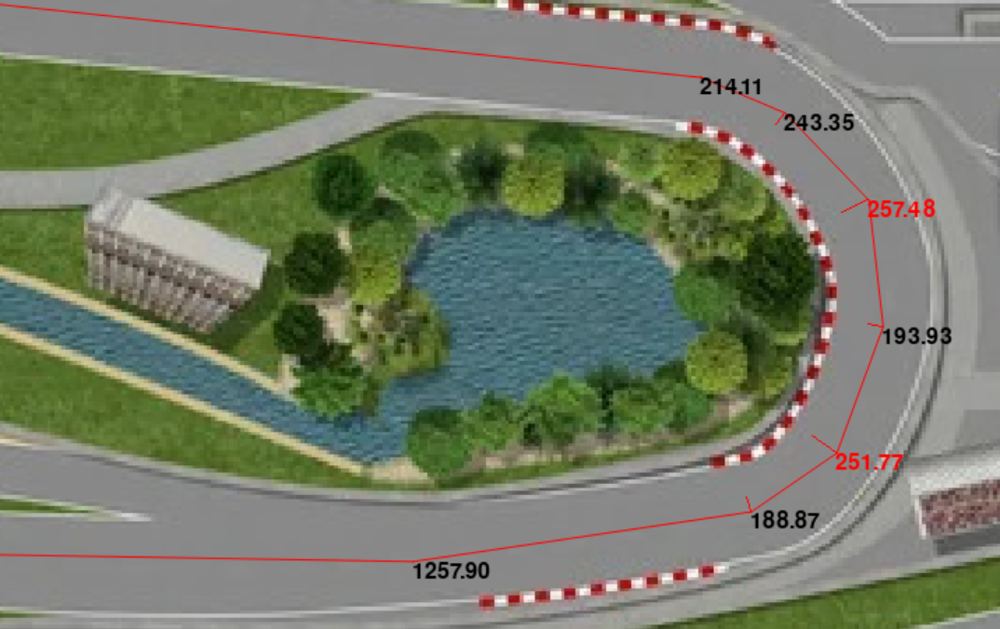

###

<!-- generate with c:\temp\pandoc-3.5\pandoc -t revealjs -s -o index.html slides.md --include-in-header=style.html -V theme=night -V embedded=1 -->

### Timeline

###

###

###

### High level

- at startup: analyse track
- every tick:
    - `self._goFast()`
    - `self._thatWay()`

### Track analysis

- determine apexes
- cut corners in apexes
    - by `CORNER_CUT_FACTOR`
- cut corners in adjacent waypoints
    - by half of that

### Track analysis

- determine speed limits
    - waypoint sharpness = distance to closest neighbour / angle
    - `SPEED_LIMIT_FACTOR` * sharpness + `SPEED_LIMIT_OFFSET`

### Track analysis

### Going fast

- determine distance to stop
    - using `EFFECTIVE_DECELERATION`
- check speed limit of waypoints in that distance
    - determine distance to brake for that limit
    - if so, brake!
- else, go fast!

### Going in the right direction

- check if the next waypoint is 'guaranteed'
    - using `STEER_DISTANCE_LIMIT` and `STEER_ANGLE_LIMIT`
    - if so, start steering to waypoint after that
- calculate steering output based on angle
    - using `STEERING_FACTOR`

### Racing

### Parameters

- `CORNER_CUT_FACTOR`
- `SPEED_LIMIT_FACTOR`
- `SPEED_LIMIT_OFFSET`
- `EFFECTIVE_DECELERATION`
- `STEER_DISTANCE_LIMIT`
- `STEER_ANGLE_LIMIT`
- `STEERING_FACTOR`

### Brawn over brains

- maybe not the best ideas
- but make the best out of it
    - optimize parameters using `brute_force.py`

### brute_force.py

- provide range of values for each parameter
- runs the bot in multiple races in parallel
    - for each track
    - for each cartesian product of the ranges
- shows best parameter sets for each track
- and parameter sets that improve the performance the most

###

